# 基于 FPGA 的具身智能机器人实时感知与自主控制系统设计方案

## —— 应急巡检/救援机器人「救援先锋」号

> **赛题**：题三 · 基于 FPGA 的具身智能机器人实时感知与自主控制系统设计（高云半导体）
> **硬件平台**：小梅哥 ACG720 开发板（高云 GW5AT-138K FPGA）+ RK3588 边缘 AI 平台
> **方案定位**：概要方案，聚焦"任务与场景创新 + 双核协同落地"

---

## 目录

1. [题目分析与总体思路](#1-题目分析与总体思路)
2. [总体系统架构](#2-总体系统架构)
3. [硬件平台与接口设计](#3-硬件平台与接口设计)
4. [FPGA 实时感知与控制子系统（任务 1–4）](#4-fpga-实时感知与控制子系统任务-14)
5. [RK3588 边缘 AI 子系统（任务 5–6）](#5-rk3588-边缘-ai-子系统任务-56)
6. [软硬件协同方案](#6-软硬件协同方案)
7. [创新设计（场景化，重点）](#7-创新设计场景化重点)
8. [系统稳定性设计](#8-系统稳定性设计)
9. [实现路线图](#9-实现路线图)
10. [评分对照表](#10-评分对照表)
11. [风险与对策](#11-风险与对策)

---

## 1. 题目分析与总体思路

### 1.1 题目解读

本题核心是一个典型的**异构算力分工**问题：

- **实时性强的任务**（传感器采集、运动控制、避障）→ 交给 FPGA，微秒级确定性响应；
- **智能性强的任务**（视觉识别、语义理解、全局决策）→ 交给 RK3588，其 6 TOPS NPU 擅长神经网络推理；
- 二者通过**低速控制链路 + 高速数据链路**协同，构成一套"**底层快、上层智**"的具身智能系统。

### 1.2 评分权重拆解与策略

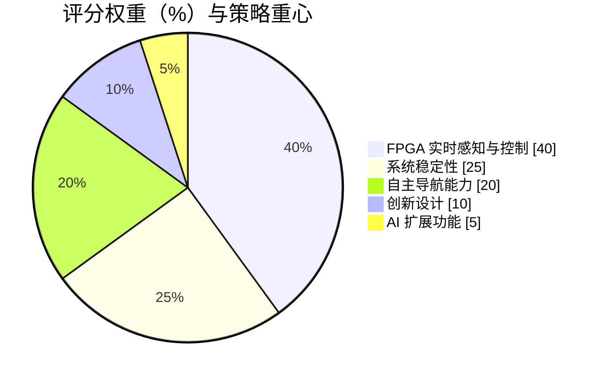

| 评分项 | 权重 | 我们的策略 |
|---|---|---|
| FPGA 实时感知与控制 | 40% | **重点投入**：任务 1–4 全部落在 FPGA，且做到"多传感器融合 + 编码器闭环 + 避障状态机"三件套扎实 |
| 系统稳定性 | 25% | **重点投入**：看门狗、急停、通信超时保护、双冗余安全（救援场景天然强调"绝不停摆"） |
| 自主导航能力 | 20% | 路径点导航 + 语义导航，融入"搜救任务链"场景 |
| 创新设计 | 10% | 创新落在**任务与场景**层面：具身任务链、救援场景叙事 |
| AI 扩展功能 | 5% | YOLO 目标识别 + 目标跟随/语义任务，作为加分项 |

> **核心结论**：40% + 25% = 65% 的分值集中在 FPGA 实时控制与稳定性，这是本方案的**基本盘**；创新与 AI 是**差异化**。因此方案策略为"**基本盘做扎实、场景做亮眼**"。

### 1.3 总体思路：一主线、双核心、三层次

- **一条主线**：把题目要求的 6 个任务，串联成一条完整的**应急巡检/救援任务链**，而非零散堆功能；
- **双核心**：FPGA（实时层）+ RK3588（智能层）双核协同；
- **三层次**：感知层 → 决策/控制层 → 执行层。

---

## 2. 总体系统架构

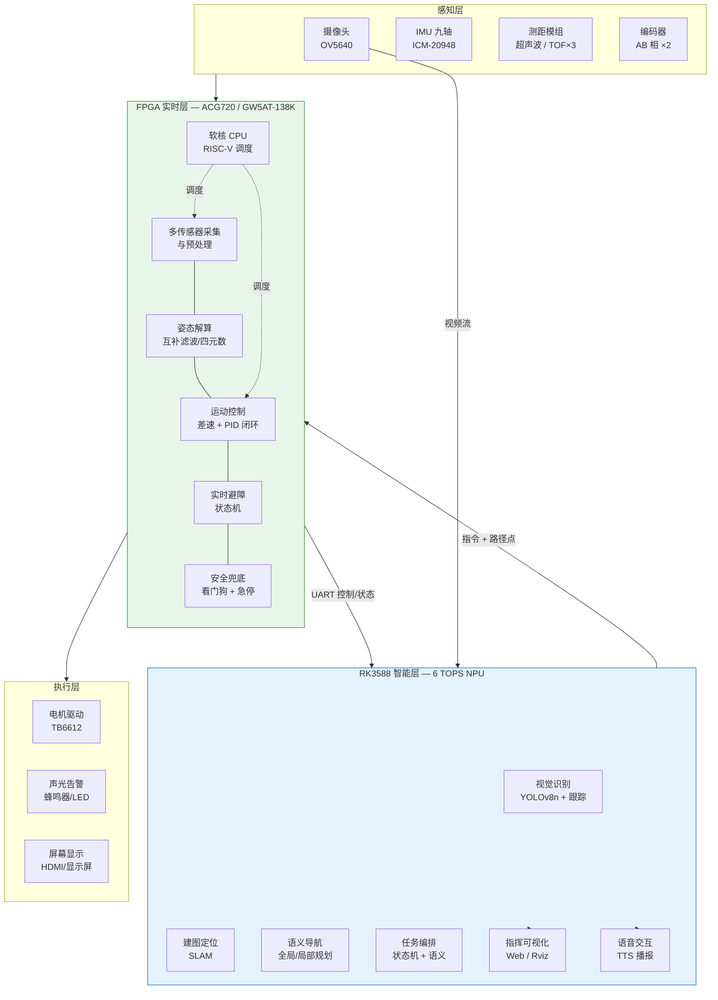

**分工原则一句话**：凡是"慢了会出事"的（控制、避障、急停），全在 FPGA；凡是"需要理解"的（识别、语义、规划），全在 RK3588。

### 数据流

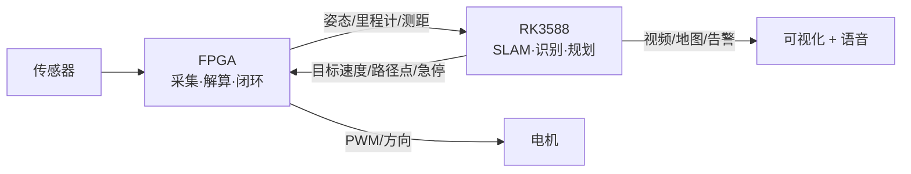

---

## 3. 硬件平台与接口设计

### 3.1 平台资源

| 模块 | 关键资源 | 在本方案中的作用 |
|---|---|---|
| **ACG720（GW5AT-138K）** | 138K LUT、256MB DDR3、128Mb QSPI Flash、50M 晶振 | 实时感知 + 运动控制 + 避障 + 安全兜底 |
| 千兆以太网（RGMII） | 板载 | 与 RK3588 传输视频流/语义地图（高带宽） |
| 双路 HDMI（双向） | 板载 | 摄像头画面/地图显示 |
| CMOS 摄像头接口 | 板载 | 接 OV5640 摄像头 |
| USB2.0（CY7C68013） | 板载 | 调试 / 备选数据通道 |
| ADC / 按键 / LED / 数码管 | 板载 | 电压监测、急停、状态指示 |
| **RK3588** | 4×A76 + 4×A55、Mali-G610、**6 TOPS NPU**、8/16GB 内存 | YOLO 识别、SLAM、语义导航、任务编排 |
| RK3588 外设 | PCIe3.0 / USB3.0 / 双千兆网 / MIPI CSI / 多路 UART·I2C·GPIO | 与 FPGA 通信、接摄像头、扩展 |

### 3.2 传感器与执行器选型

| 器件 | 型号 | 接口 | 用途 |
|---|---|---|---|
| 摄像头 | OV5640（500 万） | DVP / MIPI | 画面采集 + 显示 + 供 RK3588 识别 |
| IMU | ICM-20948（九轴） | I2C / SPI | 姿态角实时显示 + 航向 |
| 测距 ×3 | 超声波 HC-SR04 / TOF VL53L1X | GPIO / I2C | 前、左、右三向障碍检测 |
| 电机 ×2 | 直流减速电机（带编码器） | PWM + AB 相 | 差速驱动底盘 |
| 电机驱动 | TB6612 / DRV8874 | PWM / DIR | 驱动电机 |
| 声光告警 | 蜂鸣器 + 高亮 LED | GPIO | 目标定位后声光提示 |

### 3.3 接口连接示意

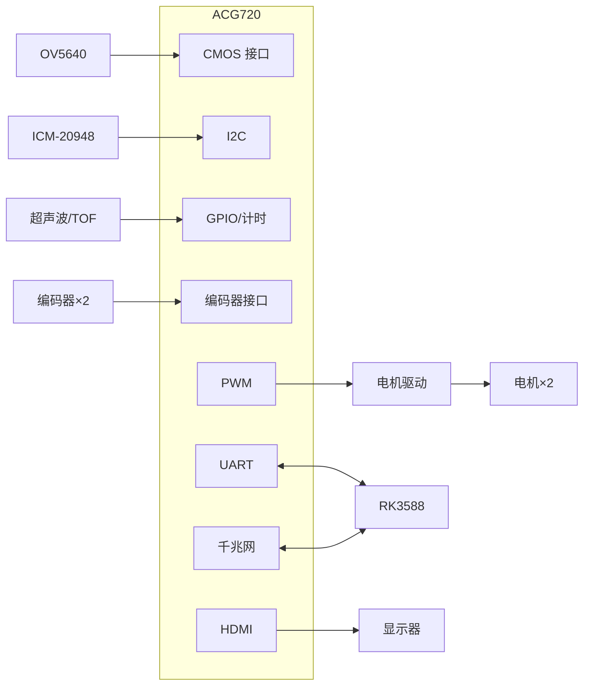

---

## 4. FPGA 实时感知与控制子系统（任务 1–4）

### 4.1 FPGA 内部模块框图

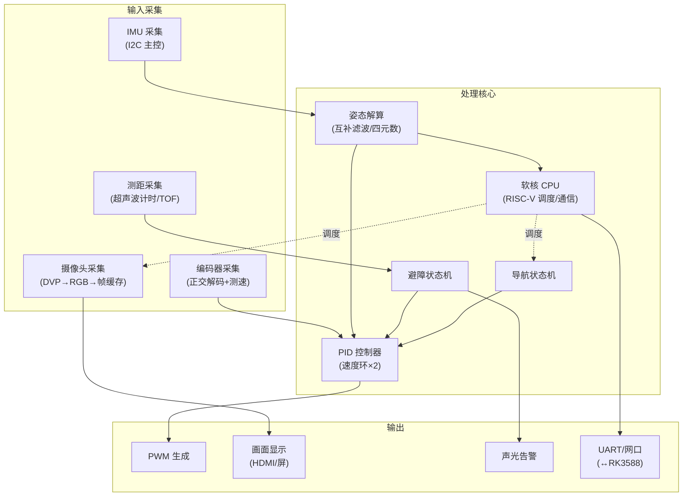

### 4.2 任务 1：多传感器感知

- **摄像头采集与显示**：OV5640 采集 → Bayer 转 RGB → 帧缓存（DDR3）→ HDMI/屏输出。**实时显示摄像头画面**。
- **IMU 姿态采集与解算**：I2C 读取九轴数据 → 互补滤波融合加速度计/陀螺仪 → 输出欧拉角（横滚/俯仰/偏航）。
- **实时显示**：屏幕分屏显示"**摄像头画面 + 姿态角数值**"（姿态角叠加上方 OSD）。

### 4.3 任务 2：运动控制

- 差速底盘：两轮速度通过左右轮差速实现**前进、后退、转向、定点旋转**。
- **编码器反馈闭环**：正交解码测速 → 速度环 PID → PWM 输出，消除打滑/负载影响，保证直线与转向精度。

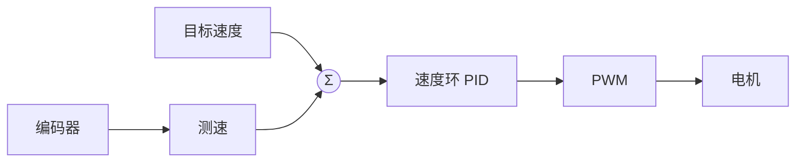

### 4.4 任务 3：实时避障（状态机）

三路测距（前/左/右）分级处理，实现"**检测 → 自动减速 → 自动停车 → 自主绕障**"：

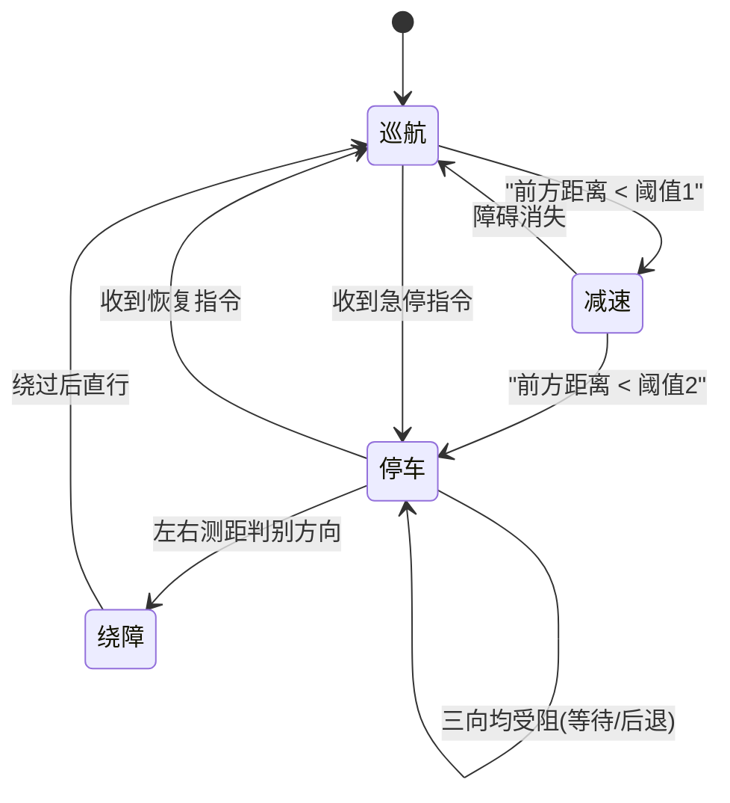

> 避障状态机在 **FPGA 内以纯硬件/极低延迟逻辑实现**，不依赖 RK3588，是救援场景"安全兜底"的第一道防线。

### 4.5 任务 4：自主导航

- 采用**路径点导航**：RK3588 规划出全局路径并下发关键路径点（waypoints），FPGA 依次"追踪"这些点。
- FPGA 侧执行**航点跟踪 + 局部避障**：依据里程计/IMU 计算当前位姿，向目标点逼近；途中障碍触发 4.4 状态机绕障，绕过后重新回归路径。
- 起点到终点自主移动 + 障碍避让 + 路径点导航，闭环达成。

---

## 5. RK3588 边缘 AI 子系统（任务 5–6）

### 5.1 软件框架

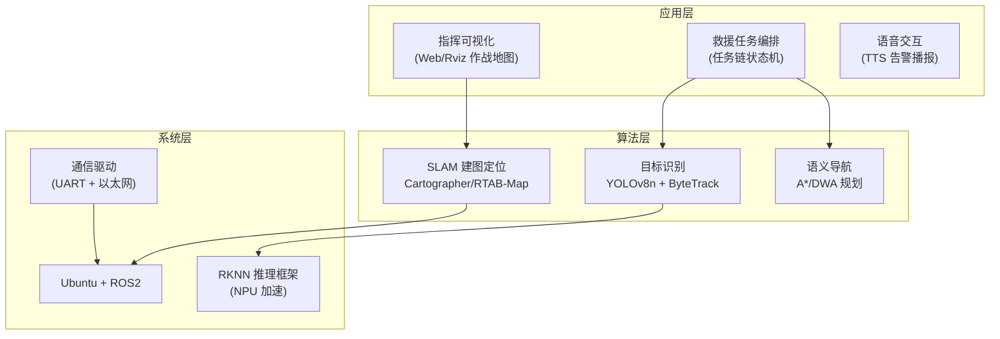

### 5.2 任务 5：视觉目标识别

- 用 **YOLOv8n**（轻量）通过 **RKNN 工具链量化**部署到 RK3588 NPU，实现实时目标检测；
- 识别类别结合救援场景：**人员（被困者）、火源/危险标记、待搜救目标物（如灭火器、药箱、红色水瓶等）**；
- 目标跟踪（ByteTrack）支持"**指定目标跟随**"，如跟随救援人员或持续锁定目标物。

### 5.3 任务 6：智能任务执行

将视觉识别结果接入任务编排，实现"**目标搜索 → 语义导航 → 自主任务执行**"：

- **语义导航**：把"找到红色水瓶并移动到其附近"这类指令解析为"目标类别 + 导航 + 到达判断"；
- **自主任务执行**：识别到目标 → 规划路径 → 导航至附近 → 触发 FPGA 声光告警 → 回传目标坐标 → 继续下一任务或返航。

---

## 6. 软硬件协同方案

### 6.1 任务分配总表

| 功能 | FPGA（ACG720） | RK3588 | 说明 |
|---|---|---|---|
| 摄像头采集/显示 | ✅ | — | 低延迟，画面不经过网络 |
| IMU 姿态解算 | ✅ | 可选二次融合 | FPGA 出姿态角，RK3588 用于 SLAM |
| 编码器闭环 | ✅ | — | 必须 FPGA，确定性时序 |
| 实时避障 | ✅ | — | 安全兜底第一道 |
| 路径点导航执行 | ✅ | 路径点生成 | RK 规划，FPGA 执行 |
| 目标识别/跟踪 | — | ✅ | NPU 加速 |
| SLAM/语义导航 | — | ✅ | 计算密集 |
| 任务编排/语音/可视化 | — | ✅ | 高层智能 |

### 6.2 通信协议

- **控制链路（UART）**：RK3588 → FPGA 下发"速度指令/路径点/急停/恢复"；FPGA → RK3588 回传"姿态角、里程计、测距、电机状态、心跳"。
  - 帧格式示例：`帧头(2B) + 长度 + 命令字(1B) + 数据 + 校验(CRC8) + 帧尾`
- **数据链路（千兆以太网）**：传输视频流、语义地图、检测结果等大带宽数据。

### 6.3 协同时序（典型任务链一次任务）

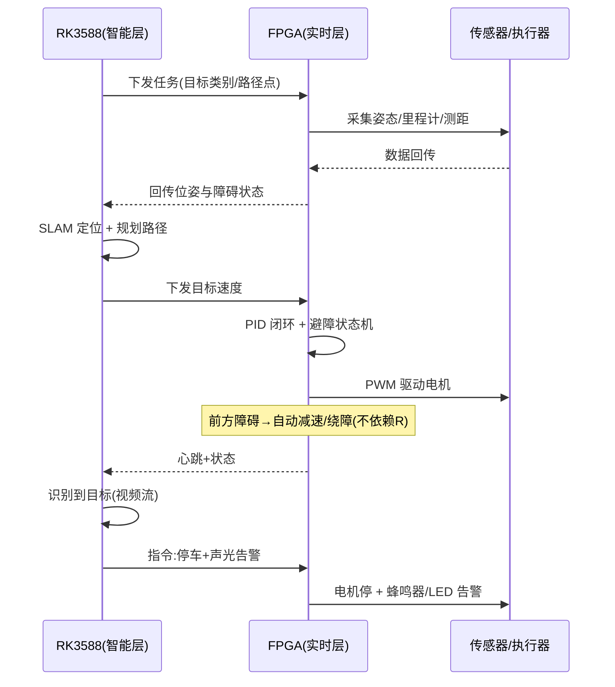

---

## 7. 创新设计（场景化，重点）

> 本方案的创新点集中在**任务组织方式与场景叙事**，而非底层技术堆砌。

### 7.1 场景设定：灾后室内应急巡检/救援

用**纸箱障碍 + 红色"火源"标记 + 模拟被困人员/待救物**搭建一个"灾后现场"演示场地，机器人作为"**救援先锋**"号进入执行任务。

### 7.2 具身任务链（核心创新）

把 6 个题目任务编排成一条连贯的救援任务链，一次完整演示覆盖全部评分点：

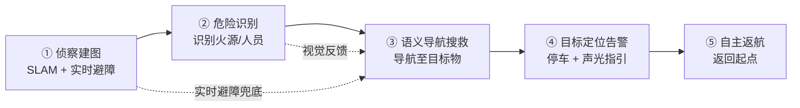

| 环节 | 对应任务 | 机器人动作 |
|---|---|---|
| ① 侦察建图 | 任务 1/3/4 | 自主进入场地，SLAM 建图，实时避障 |
| ② 危险识别 | 任务 5 | 识别"火源""被困人员""待救物" |
| ③ 语义导航搜救 | 任务 4/6 | 导航至"红色灭火器/药箱"等目标 |
| ④ 目标定位告警 | 任务 6 | 停车 + 蜂鸣器/LED + 语音播报 + 回传坐标 |
| ⑤ 自主返航 | 任务 4 | 沿路径返回起点/指挥点 |

### 7.3 创新点清单（任务/场景层面）

1. **具身任务链编排**：将单点任务（如"找红水瓶"）升维为"侦察→识别→搜救→指引→返航"的多任务链式自主执行，展示系统**整体性**而非功能拼盘。
2. **场景化语义导航**：路径点导航被赋予"搜救业务含义"，每个航点对应一个救援语义（排查区、目标区、撤离区），评分时叙事清晰、演示有代入感。
3. **人机协同 + 双冗余安全**：FPGA 实时避障是"兜底"，RK3588 语义决策是"大脑"，二者叠加满足救援场景"绝不停摆"的核心诉求。
4. **救援指挥可视化**：Web/Rviz 实时显示机器人位姿、建图、目标标记，形成"**作战地图**"指挥视角，展示效果直观（对创新分加分明显）。
5. **声光人机交互**：识别到目标后"语音播报 + 屏显 + LED 声光告警"，模拟真实救援中"发现目标、向后方标记"的完整闭环。

---

## 8. 系统稳定性设计

| 措施 | 实现方式 | 应对风险 |
|---|---|---|
| FPGA 看门狗 | 软核 CPU 定期喂狗，超时复位外设 | 程序跑飞/死锁 |
| 通信心跳 | FPGA↔RK3588 定时心跳，超时判定 | RK3588 卡死/掉线 |
| 通信超时保护 | RK3588 失联时 FPGA 自动**减速停车** | 决策层故障 |
| 硬件急停 | 独立按键/外部急停，最高优先级 | 失控 |
| 电机堵转保护 | 检测编码器异常 + 电流监测，自动停转 | 电机堵转/短路 |
| 状态机互锁 | 所有运动状态互斥，非法跳转自动回安全态 | 逻辑错误 |
| 电压监测 | ADC 采集电池电压，低电量告警 | 供电异常 |

> **要点**：稳定性设计是 25% 权重所在，且"救援"场景天然强调安全冗余——这是本方案与一般机器人方案的重要差异点。

---

## 9. 实现路线图

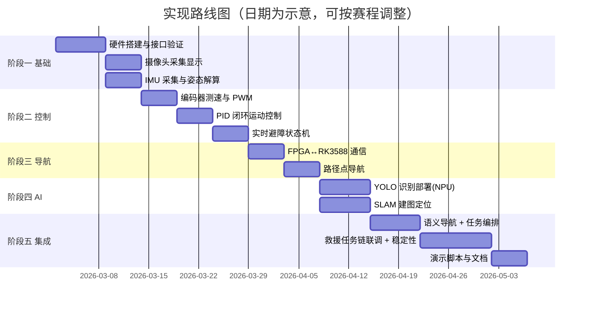

---

## 10. 评分对照表

| 评分项 | 占比 | 方案对应内容 | 亮点 |
|---|---|---|---|
| FPGA 实时感知与控制 | 40% | 第 4 章（任务 1–4） | 多传感器融合、姿态解算、PID 闭环、避障状态机、航点导航 |
| 系统稳定性 | 25% | 第 8 章 | 看门狗、心跳、超时急停、堵转保护、状态机互锁 |
| 自主导航能力 | 20% | 第 4.5 + 6 + 7.2 | 路径点导航 + 语义导航，融入救援任务链 |
| 创新设计 | 10% | 第 7 章 | 具身任务链、救援场景、指挥可视化、声光交互 |
| AI 扩展功能 | 5% | 第 5 章 | YOLO 识别 + 目标跟踪 + 语义任务执行 |

---

## 11. 风险与对策

| 风险 | 影响 | 对策 |
|---|---|---|
| FPGA 资源紧张 | 无法容纳全部模块 | 选用 138K 型号；模块分时复用；摄像头帧缓存走 DDR3 |
| FPGA↔RK3588 通信延迟/丢包 | 控制不及时 | 控制走 UART（低延迟），大带宽走网口；CRC 校验 + 心跳重发 |
| NPU 模型精度不足 | 识别误判 | RKNN 量化调优；现场光照数据增强；传感器融合兜底 |
| 底盘打滑/编码器噪声 | 定位漂移 | PID 标定 + IMU 航向融合修正 |
| 场地光照变化 | 视觉不稳定 | 识别与避障双通道冗余，FPGA 测距兜底 |
| 演示超时/异常 | 影响评分 | 状态机互锁 + 一键恢复，演示脚本留冗余时间 |

---

## 附：方案一句话总结

> **以 FPGA（ACG720/GW5AT-138K）为"实时肌体"，以 RK3588 为"智能大脑"，双核协同，把题目六项任务编排成一条"侦察—识别—搜救—指引—返航"的应急救援任务链，在扎实的实时控制与稳定性之上，用场景化创新点亮演示。**
